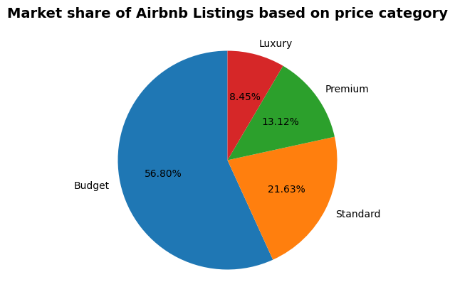
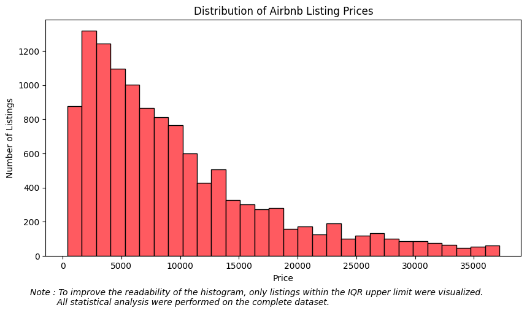
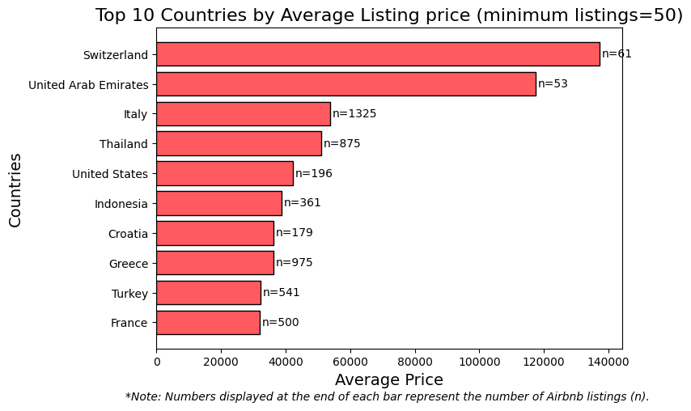
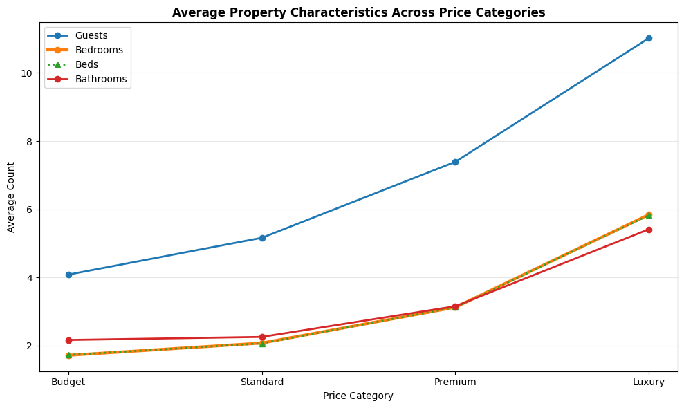
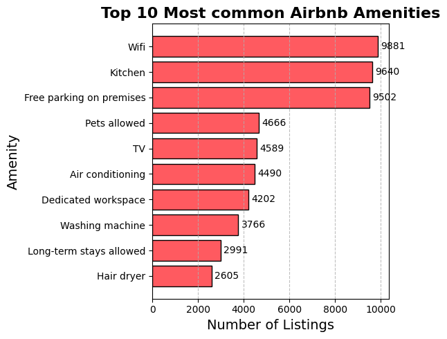

# 🏡 Airbnb Market Analysis

An end-to-end Exploratory Data Analysis (EDA) project built with Python to analyze Airbnb listings and uncover insights into pricing trends, customer engagement, property characteristics and market dynamics.

The project follows a complete analytics workflow—from cleaning raw data to generating business insights and recommendations through visualization.

---

## 📌 Project Overview

The objective of this project is to explore Airbnb listing data and answer practical business questions using data analysis.

The analysis focuses on identifying patterns in pricing, customer ratings, amenities, host activity and property characteristics to better understand the Airbnb marketplace.

This project demonstrates the complete data analysis process including:

- Data Cleaning
- Feature Engineering
- Exploratory Data Analysis (EDA)
- Data Visualization
- Business Insights
- Recommendations

---
## 📸 Project Preview

### Price Category Distribution
<p align="center">
  
</p>

### Price Distribution
<p align="center">
  
</p>

### Top Countries by Average Listing Price
<p align="center">
  
</p>

### Property Characteristics Across Price Categories
<p align="center">
  
</p>

### Top 10 Most Common Amenities
<p align="center">
  
</p>

---

## 🛠️ Tools & Libraries

- Python
- Pandas
- NumPy
- Matplotlib
- Google Colab

---

## 📂 Repository Structure

```text
Airbnb-Market-Analysis/
│
├── data/
│   ├── airbnb_raw_data.csv
│   └── airbnb_cleaned.csv
│
├── images/
│
├── notebooks/
│   ├── 01_Data_Cleaning.ipynb
│   └── 02_Airbnb_Market_Intelligence.ipynb
│
├── README.md
└── requirements.txt
```

---

## 📊 Business Questions Answered

This project answers several business-oriented questions, including:

- How are Airbnb listings distributed across different price categories?
- Do higher-priced listings receive better customer ratings?
- How do property characteristics influence listing prices?
- Which countries have the highest average Airbnb prices?
- Which hosts manage the largest number of listings?
- What are the most commonly offered amenities?
- How do popular amenities relate to average listing prices?
- How does customer engagement vary across different rating groups?

---

## 🔍 Key Insights

Some important findings from the analysis include:

- Budget listings make up the largest share of Airbnb properties.
- Property size generally increases with price.
- Switzerland and the UAE have the highest average listing prices among countries with sufficient listings.
- WiFi, Kitchen and Free Parking on Premises are the most commonly available amenities.
- Higher-rated listings generally receive more customer reviews, indicating stronger guest engagement.
- A small number of hosts manage a disproportionately large number of Airbnb listings.

---

## 📈 Project Workflow

```
Raw Dataset
      │
      ▼
Data Cleaning
      │
      ▼
Feature Engineering
      │
      ▼
Exploratory Data Analysis
      │
      ▼
Data Visualization
      │
      ▼
Business Insights
      │
      ▼
Recommendations
```

---

## 📁 Dataset

The dataset contains Airbnb listing information such as:

- Property Name
- Host Details
- Price
- Ratings
- Reviews
- Address
- Amenities
- Safety Rules
- House Rules
- Property Features

During preprocessing, additional features including **Guests, Bedrooms, Beds, Bathrooms** and **Country** were extracted from the raw dataset to support deeper analysis.

---

## 🚀 How to Run

### 1. Clone the repository

```bash
git clone https://github.com/ronakagarwall/Airbnb-Market-Analysis.git
```

### 2. Install the required libraries

```bash
pip install -r requirements.txt
```

### 3. Run the notebooks

Run the notebooks in the following order:

1. `01_Data_Cleaning.ipynb`
2. `02_Airbnb_Market_Intelligence.ipynb`

---

## 💼 Skills Demonstrated

- Data Cleaning & Preprocessing
- Feature Engineering
- Exploratory Data Analysis (EDA)
- Data Visualization
- Business Analysis
- Insight Generation
- Python Programming
- Data Storytelling

---

## 🔮 Future Improvements

Possible extensions of this project include:

- Interactive dashboard using Power BI or Tableau
- Predictive price modelling using Machine Learning
- Geospatial analysis of Airbnb listings
- Time-series analysis using historical Airbnb data

---

## 👨‍💻 Author

**Ronak Agarwall**

Aspiring Data Analyst passionate about using data to solve business problems and transform raw datasets into actionable insights.

If you found this project useful, feel free to ⭐ this repository.
